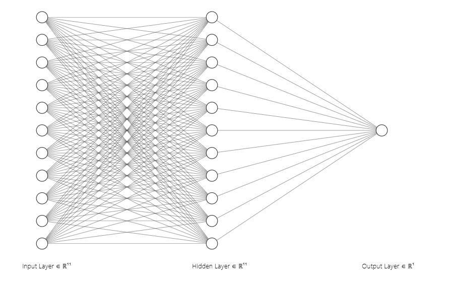
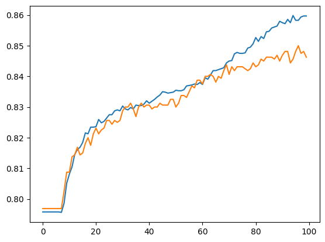
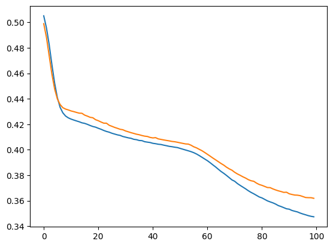

# Customer Churn Prediction

## Overview

This project aims to predict whether a customer will churn (leave the service) based on their demographic, behavioral, and service usage data. Using an **Artificial Neural Network (ANN)** built in Python, the model learns from historical customer data and identifies churn patterns. The approach helps organizations improve customer retention strategies by proactively identifying customers at risk.

The project involves data preprocessing, encoding categorical variables, feature scaling, model design using dense layers, training, and evaluation. The model outputs churn probabilities, allowing data-driven decision-making for customer relationship management.

## Directory Structure

```md
Customer-Churn-Prediction-ANN/
│
├── data/                             
│   └── Churn_Modelling.csv      
│
├── images/                           
│   ├── accuracy.png           
│   ├── loss.png           
│   └── NN-architecture.png                 
│
├── .gitignore
├── pipeline.ipynb
├── requirements.txt
└── README.md

```

## Workflow

1. Data Loading 
    - Import the dataset into the notebook.
2. Data Preprocessing
    - Handle missing values
    - Encode categorical features
    - Perform feature scaling.
3. Splitting Data 
    - Divide data into training and test sets.
4. Model Architecture
    - Input layer: 11 neurons
    - Hidden layer: 11 neurons with sigmoid activation functions.
    - Output layer: 1 neuron sigmoid activation for binary classification.
5. Model Compilation 
    - **Optimizer**: Adam
    - **Loss Function**: Binary Crossentropy
    - **Metric**: Accuracy
6. Model Training
    - Train the model on the training dataset for a fixed number of epochs.
7. Evaluation:
    - Test accuracy and loss on the validation dataset.
8. Visualization:
    - Display accuracy and loss curves.

## Model Architecture

- Input layer: 11 neurons
- Hidden layer: 11 neurons with sigmoid activation functions.
- Output layer: 1 neuron sigmoid activation for binary classification.



## Results

Model Accuracy: 79.75%

<table>
    <tr>
        <th>Accuracy curve</th>
        <th>Loss curve</th>
    </tr>
    <tr>
        <td></td>
        <td></td>
    </tr>
</table>

## Contributor

<a href="https://github.com/Saumyajeet-Varma"></a>
